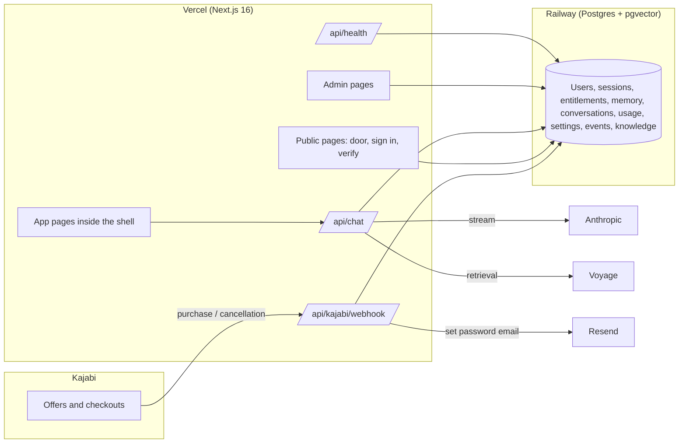

# Architecture note

This is the architecture note promised in Schedule A. It is written so that a developer who has never seen the code can find their way around in an afternoon. Every section names the files it is describing.

## The shape of it

One Next.js application, one Postgres database, three third party APIs. There is no separate API server, no queue, no cache layer. At the subscriber counts this business is planning for, that is the right amount of infrastructure, and it keeps the monthly bill where the running costs document said it would be.

## Route groups

`src/app` is split into three route groups so that access control lives in layouts rather than in every page.

| Group | Who | Guard | Layout |
| --- | --- | --- | --- |
| `(auth)` | Anyone | None | Plain, centred forms. Sign in, sign up, verify email, reset and set password. Server actions in `src/app/(auth)/actions.ts`. |
| `(app)` | Verified subscribers | `requireUser()` in `src/app/(app)/layout.tsx` | `AppShell` from `src/components/app-shell/shell.tsx`: rail on the left on a laptop, a drawer on a phone, and a `main` that is a flex column so the chat composer can pin to the bottom. |
| `(admin)` | Admins | `requireAdmin()` in `src/app/(admin)/layout.tsx` | Erica's view, with its own top bar and sub nav (`src/components/admin/nav.tsx`): Overview, Users, Advisors, Suites, Knowledge, Kajabi, Usage, Settings. |

Outside the groups: `src/app/page.tsx` is the door (redirects a verified session to `/advisors`), `not-found.tsx` and `error.tsx` are the quiet fallbacks, `manifest.ts` makes "Add to Home Screen" behave like an app, `robots.ts` keeps the whole thing out of search engines, and `icon.tsx` and `apple-icon.tsx` generate the icons.

`src/proxy.ts` is Next 16's middleware. It only sets security headers. Authentication is deliberately not done there, because middleware cannot check the session against the database.

## Sessions, and why the raw token is never stored

`src/lib/auth/session.ts`.

Signing in creates a `Session` row and sets an `hoa_session` cookie. The cookie holds a random 32 byte token. The database holds only the SHA-256 of that token as the row id. So:

- Someone who reads the database cannot sign in as anyone, because they have hashes, not tokens.
- Signing out on one device revokes one row. "Sign out everywhere" and a password change revoke all of them (`revokeAllSessions`).
- Sessions last thirty days and quietly renew when more than half used. `lastSeenAt` is updated at most every five minutes, and the update is fire and forget so a slow write never blocks a page.

`getSession()` is wrapped in React `cache`, so the root layout, the app layout and the page share one lookup per request.

`src/lib/auth/current-user.ts` turns that into three helpers: `requireUser()` for pages (redirects to sign in, then to verify email), `requireAdmin()`, and `userFromRequest()` for route handlers where a redirect is the wrong shape.

Password hashing is argon2id (`src/lib/auth/password.ts`). Single use email tokens for verify, reset and set password are stored hashed as well (`src/lib/auth/tokens.ts`). Sign in is rate limited by email and by IP in the database, not in the browser (`src/lib/auth/rate-limit.ts`).

## The entitlement model

`prisma/schema.prisma`, `src/lib/entitlements.ts`.

An `Entitlement` says: this user may open this advisor, or this suite, because of this source (`KAJABI`, `ADMIN`, `COMP`), and it is `ACTIVE`, `REVOKED` or `EXPIRED`. Kajabi grants carry the `kajabiOfferId` (and the Kajabi member id for reference), so a cancellation for the same email and offer id revokes exactly the rows that purchase created, and never touches an admin or comp grant.

A suite is five subscriptions in a trench coat. `SuiteAdvisor` lists the members, and owning a suite unlocks each of them. `getAdvisorAccess(userId)` resolves every active advisor to unlocked or locked by taking the **union** of direct advisor entitlements and suite memberships. If a subscriber owns Lyra directly and also owns a suite that includes Lyra, both routes are recorded in `via` and the **cap is the maximum** of the two monthly token caps. Nothing is ever double counted or double charged; the bigger allowance simply wins.

Every Kajabi offer on the sales page includes Evren, so Lyra's offer id is mapped on both Lyra and Evren, and the webhook grants both.

## The two memory layers and MemoryFact

The core decision from How It Will Work, questions one and two: memory must not live inside Evren. It sits above all five advisors.

| Layer | Where it lives | Written by |
| --- | --- | --- |
| Shared intake, taken once at sign up | `Profile.intake` as `{ questionId: answer }` | The onboarding flow. Questions come from the `intake.questions` setting. |
| Advisor specific questions, asked on first meeting | `Profile.advisorIntakes` as `{ advisorSlug: { questionId: answer } }` | The chat page, from `Advisor.onboardingQuestions`. |
| Durable facts | `MemoryFact` rows: category, content, source, archivedAt | Intake, the subscriber on the memory screen, and `extractMemories` after each exchange. |
| Rolling summaries | `Conversation.summary` and `Profile.summary` | `maybeSummariseConversation` once a conversation passes the threshold setting. |

`MemoryFact` is the unit a subscriber can see and correct. Archiving sets `archivedAt` rather than deleting, so a wrong correction can be undone and the prompt builder skips archived facts. Categories (`CLIENT`, `OFFER`, `LAUNCH`, `POSITIONING`, `GOAL`, `BLOCKER`, `PREFERENCE`, `OTHER`) are what make the memory screen readable and let the prompt group facts sensibly.

## The chat request lifecycle

`src/app/api/chat/route.ts`, with `src/lib/ai/prompt.ts`, `src/lib/ai/memory.ts`, `src/lib/knowledge/search.ts`.

1. **Auth.** `userFromRequest()`. No session, or unverified email, gives 401.
2. **Validate.** Body is `{ advisorSlug, conversationId?, messages }`, checked with zod.
3. **Access.** `getUnlockedAdvisor(userId, slug)`. Locked gives 403.
4. **Configured.** No `ANTHROPIC_API_KEY` gives 503 with `code: "AI_NOT_CONFIGURED"`. The UI shows an honest "not connected yet" state.
5. **Cap.** `getUsageSnapshot` against the resolved cap. Over gives 429 with `code: "OVER_CAP"` and the usage numbers.
6. **Conversation.** Found by id **and** user id **and** advisor id, or created. The server owns history; the browser never sends the whole transcript as truth.
7. **Persist the question** as a `Message`.
8. **Retrieval.** In parallel: profile, live memory facts, the last N messages (setting `chat.maxHistoryMessages`), and `searchKnowledge(text, advisorSlug)`.
9. **Prompt layers**, in order of authority, built by `buildSystemPrompt`: who the advisor is, what she must never say, the instruction hierarchy (Erica's frameworks outrank general knowledge, cite the source, say when going beyond it), everything known about this client, the retrieved passages, and the house writing rules including the no dashes rule.
10. **Stream.** `streamText` with the advisor's model, returned as `toUIMessageStreamResponse()` with an `x-conversation-id` header so a brand new conversation gets its id on the first reply.
11. **On finish.** Save the answer with token counts and citations, bump `updatedAt`, record usage.
12. **After the response** (`after()`): extract memories, maybe summarise, and title the conversation if it is the first turn. All three are best effort on the cheap model and never block or fail the reply.

## Usage ledger and caps

`src/lib/usage.ts`, `UsageLedger`.

Every request writes two rows for the month (`YYYY-MM` in UTC): one for the advisor and one with `advisorId` null as the subscriber's total. Input and output tokens both count, because both are billed. Cost is estimated in microdollars from the `usage.pricing` setting so cents are never rounded away, and so Erica can compare the ledger to the Anthropic invoice.

The cap is a hard stop, checked before the model is called. The `usage.warnAtPercent` setting (default 80) drives the warning the subscriber sees before they hit it. Caps live on `Advisor.monthlyTokenCap` and `Suite.monthlyTokenCap` and are editable in Admin.

## The Kajabi webhook flow

`src/app/api/kajabi/webhook/route.ts`, `src/lib/kajabi.ts`, `KajabiEvent`.

Kajabi does not sign webhooks, so the URL carries `?token=KAJABI_WEBHOOK_SECRET`, compared in constant time. Then:

1. The raw payload is stored **verbatim** as a `KajabiEvent` before anything interprets it. That is what makes every grant and revoke auditable, and what lets an unmapped offer be mapped later and replayed.
2. `normaliseKajabiPayload` digs the event type, member email, name, member id, offer id and offer title out of the several shapes Kajabi and Zapier style forwarders produce. The event type comes from an `x-kajabi-event` or `x-event-type` header first, then from `event`, `event_type`, `type`, `topic` or `name` in the body. Event names containing purchase, grant, created, activated, subscri, paid or success mean grant, unless the same name also contains a revoke word; cancel, revok, refund, expir, remov, deactivat or fail mean revoke; anything else is ignored.
3. `applyKajabiEvent` finds every advisor and suite whose `kajabiOfferIds` contains the offer id. A grant creates the user if needed (email marked verified, because a purchase proves the address), creates one `ACTIVE` entitlement per target, and sends a set password email naming the most specific thing they bought. A revoke marks the matching Kajabi sourced entitlements `REVOKED`.
4. The row is marked processed, or flagged with an error such as `offer 123 is not mapped`. Once the token has matched, the handler always returns 200 so Kajabi never retry storms; problems surface in Admin > Kajabi, not in Kajabi's logs. `replayKajabiEvent` in `src/app/(admin)/admin/actions.ts` runs a stored payload through the same `applyKajabiEvent`, which is how a purchase that arrived before its offer was mapped is granted later.

## Knowledge ingest and search

`src/lib/knowledge/chunk.ts`, `embed.ts`, `ingest.ts`, `search.ts`. Tables `KnowledgeDocument` and `KnowledgeChunk`.

A document is pasted or uploaded in Admin with a title, a source name and an advisor scope (empty means every advisor). `ingestDocument` splits it into roughly 1,400 character chunks with a 200 character overlap on paragraph boundaries, writes the chunks, then embeds them with Voyage (`voyage-3-large`, 1024 dimensions) into a pgvector column. Without `VOYAGE_API_KEY` the chunks are still written so the text is browsable, but the document stays `PENDING` with a note, and it only becomes `READY` when it can actually be retrieved.

`searchKnowledge` embeds the question as a query (Voyage uses different input types for documents and queries, which improves recall), runs a cosine nearest neighbour query limited to `READY` documents in scope for this advisor, and keeps only passages under a distance of 0.55. Those passages go into the prompt with their document titles, which is where the citations in answers come from.

## Settings as data

`src/lib/settings.ts`, `Setting` table.

Anything Erica should be able to change without a developer is a setting, not code: intake questions, chat history depth, summarise threshold, model pricing, the warning threshold, the app name, support email, sales URL and Kajabi library URL. `DEFAULTS` gives every key a typed safe value, `getSetting` and `getSettings` overlay whatever is stored, and `setSetting` upserts. Keys are strings so adding a setting is one line in `DEFAULTS` and no migration.

The same idea applies to advisors. An advisor is a row: name, title, tagline, description, system prompt, never say list, onboarding questions, model, cap, Kajabi offer ids, active flag. Everything on that row is edited in Admin > Advisors. Creating the row itself is the one step Admin does not do yet (the seed in `prisma/seed.ts` creates the five), so a sixth advisor today is one insert plus configuration; `docs/RUNBOOK.md` has the steps.
